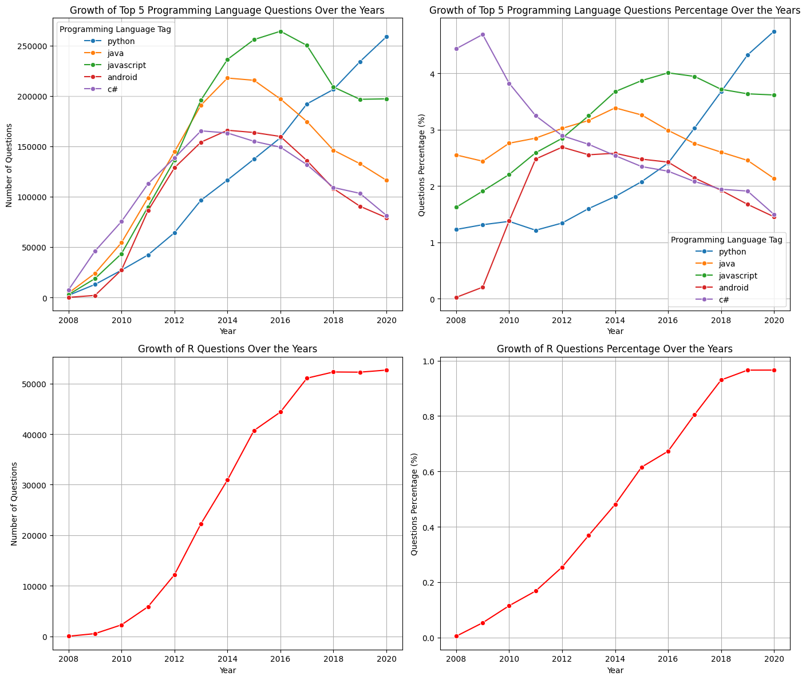

# 📊 Analyze the Popularity of Programming Languages




## 📌 Project Overview
This project analyzes the historical trends of programming languages based on Stack Overflow tag data. By examining over 420,000 rows of data, the analysis identifies which languages dominated the industry between 2015 and 2020 and tracks the specific trajectory of specialized languages like R.

## 📊 Executive Summary
The analysis reveals that **JavaScript** and **Python** maintained the highest volume of developer interest over the five-year period. While modern languages saw steady growth, established enterprise languages like Java and C# remained in the top five. The project successfully processed large-scale tag data to provide a clear picture of developer community trends.

## ❓ Key Business Questions Answered
1.  **Market Share of R:** What was the percentage of R questions for 2020? 
    * *Result: Approximately **0.97%** of all questions asked in 2020.*
2.  **Top Languages:** What were the five programming language tags with the highest total number of questions asked between 2015 and 2020?
    * *Result: JavaScript, Python, Java, Android, and C#.*

## 🛠 Tech Stack & Tools
* **Language:** Python 3.13
* **Libraries:** * `Pandas`: Data manipulation and cleaning
    * `NumPy`: Numerical operations
    * `Matplotlib`: Basic data visualization
    * `Seaborn`: Advanced statistical charting
* **Environment:** Jupyter Notebook

## ⚙️ The Data Process
1.  **Data Cleaning:** Handled missing values (only 26 nulls found in the 'tag' column) to ensure a 99.99% clean dataset.
2.  **Exploratory Data Analysis (EDA):** Aggregated question counts by year and by programming language tag.
3.  **Filtering:** Isolated data specifically for the 2015–2020 timeframe.
4.  **Visualization:** Created trend lines and bar charts to compare language volumes.

## 💡 Key Insights & Results
* **Python's Rise:** Python consistently ranks as a top performer, reflecting its dominance in data science and automation.
* **The "Big Five":** The list of top languages is dominated by web (JavaScript) and mobile/enterprise (Java, Android, C#) development.
* **Niche Stability:** Although R represents a smaller percentage (~0.97%), it maintains a stable presence in the statistical computing niche.

## ⚠️ Challenges & Solutions
* **Challenge:** Large dataset size causing potential performance lag during plotting.
* **Solution:** Optimized data grouping using Pandas `groupby` and `sum` functions before passing data to the visualization libraries to reduce memory overhead.

## 🏁 Conclusion
The data confirms that while new frameworks emerge, the core languages (JavaScript, Python, Java) continue to hold the majority of developer attention. This analysis provides a foundation for understanding which technologies are most "future-proof" for developers and businesses alike.

## 🚀 How to Run This Project
1. **Clone this repository:**
   ```bash
   git clone [https://github.com/your-username/your-repo-name.git](https://github.com/your-username/your-repo-name.git)
    ```
2.  **Install Prerequisites:**
    Ensure you have Python installed, then run:
    ```bash
    pip install pandas numpy matplotlib seaborn jupyter
    ```
3.  **Run the Analysis:**
    Open the Jupyter Notebook and execute all cells:
    ```bash
    jupyter notebook Programming_Languages_Trends.ipynb
    ```


## 👤 Author

**Haseeb Uddin**  
*Data Analyst*

| Platform | Link |
|----------|------|
| 🐙 GitHub | [github.com/Haseeb-U](https://github.com/Haseeb-U) |
| 💼 LinkedIn | [linkedin.com/in/haseeb-uddin-q/](https://www.linkedin.com/in/haseeb-uddin-q/) |
| 📊 Kaggle | [kaggle.com/haseebhsb](https://www.kaggle.com/haseebhsb) |
| 📊 Portfolio | [https://haseeb-u.github.io/](https://haseeb-u.github.io/) |

---

## 📜 License

This project is licensed under the **MIT License** — see the [LICENSE](LICENSE) file for details.
